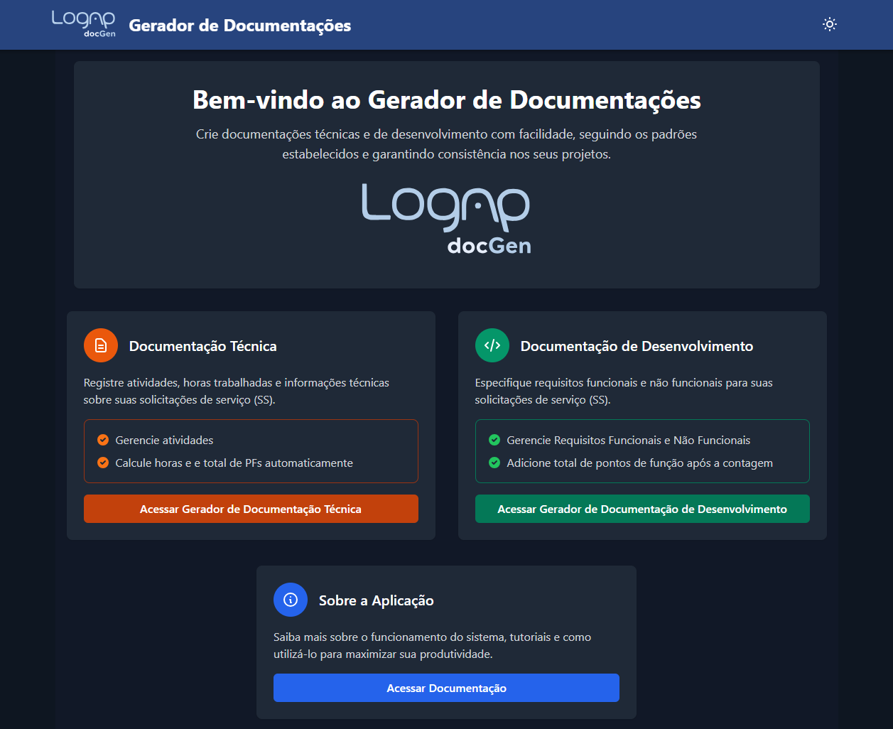

# 📝 Gerador de Documentações

[](https://www.python.org/downloads/)
[](https://flask.palletsprojects.com/)
[](https://developer.mozilla.org/en-US/docs/Web/HTML)
[](https://vuejs.org/)
[](https://tailwindcss.com/)
[](https://www.docker.com/)

Uma aplicação web para geração automática de documentos técnicos e de desenvolvimento a partir de modelos com marcadores, otimizando o fluxo de trabalho para relatórios e especificações de projetos.

Tela Inicial:

Tela de Documentações de Desenvolvimento

Tela de Documentações Técnicas


> [!NOTE]  
> Este projeto foi desenvolvido para padronizar e automatizar o processo de criação de documentos para Solicitações de Serviço (SS), reduzindo o tempo gasto na documentação e garantindo consistência nos documentos gerados.

## 📋 Sumário

- [Visão Geral](#-visão-geral)
- [Funcionalidades](#-funcionalidades)
- [Tipos de Documentação](#-tipos-de-documentação)
- [Tecnologias](#-tecnologias)
- [Requisitos](#-requisitos)
- [Instalação e Execução](#-instalação-e-execução)
- [Estrutura de Arquivos](#-estrutura-de-arquivos)
- [Modelos e Marcadores](#-modelos-e-marcadores)
- [Contribuição](#-contribuição)

## 🔍 Visão Geral

O Gerador de Documentações é uma aplicação web que facilita a criação de documentos padronizados para projetos de tecnologia. A aplicação oferece interfaces específicas para dois tipos principais de documentação:

- **Documentação Técnica**: Para registro detalhado de atividades realizadas, horas trabalhadas e cálculos de pontos de função.
- **Documentação de Desenvolvimento**: Para especificação de requisitos funcionais e não funcionais, incluindo detalhes de implementação e integração com banco de dados.

A aplicação automatiza o preenchimento dos documentos, substituindo marcadores com os dados fornecidos pelo usuário e preservando a formatação original dos modelos.

## ✨ Funcionalidades

### Interface e Usabilidade

- **Interface responsiva**: Experiência consistente em dispositivos desktop e móveis
- **Tema claro/escuro**: Alternância entre temas para conforto visual
- **Navegação intuitiva**: Troca simples entre tipos de documentação
- **Exportação flexível**: Documentos em formato JSON, DOCX e/ou PDF

### Formulário Base

- **Informações da SS**: Campos para número, ano e título da solicitação
- **Datas e descrição**: Campos para período de execução e descrição detalhada
- **Link do board**: Integração com sistemas de gerenciamento de projetos
- **Seleção de autores**: Sistema de autocompletar com sugestões e tags

> [!TIP]
> Você pode salvar seu trabalho a qualquer momento exportando apenas o arquivo JSON, que poderá ser importado posteriormente para continuar o preenchimento.

## 🗂 Tipos de Documentação

### Documentação Técnica

- **Gerenciamento de atividades**: Adicionar, editar, remover e reordenar atividades
- **Estimativa de horas**: Registro de horas por atividade
- **Cálculos automáticos**: Soma total de horas e conversão para pontos de função
- **Reordenação via drag-and-drop**: Reorganização intuitiva da lista de atividades

### Documentação de Desenvolvimento

- **Requisitos Funcionais (RF)**:
  - Especificação detalhada com ID automático
  - Reordenação via drag-and-drop: Reorganização intuitiva do RFs com atualização automática do ID
  - Editor rich text para descrição, regras e validações
  - Upload de imagens para diagramas e screenshots
  - Campos para tipo de alteração, local, usuário e perfil
  - Mudanças de banco de dados necessárias
- **Requisitos Não Funcionais (RNF)**:
  - Registro de título e descrição com ID sequencial
  - Reordenação via drag-and-drop: Reorganização intuitiva do RNFs com atualização automática do ID
  - Gerenciamento simples via interface de adição/remoção
- **Pontos de Função**: Campo para registrar o total após análise e contagem

> [!IMPORTANT]  
> Todos os documentos gerados incluem sumários que são automaticamente atualizados com os números de página corretos, garantindo navegação eficiente nos documentos finais.

## 🛠 Tecnologias

### Backend

- **Python 3.11+**
- **Flask**: Framework web leve e flexível
- **python-docx**: Manipulação programática de documentos Word
- **LibreOffice**: Conversão de documentos para PDF (Docker)

### Frontend

- **Vue.js 3**: Framework JavaScript progressivo
- **Tailwind CSS**: Framework CSS utilitário
- **Sortable.js**: Funcionalidade de drag-and-drop
- **Quill**: Editor rich text para requisitos funcionais

### Infraestrutura

- **Docker**: Containerização para implantação simplificada
- **Docker Compose**: Orquestração de contêineres

## 📋 Requisitos

### Para Desenvolvimento Local

- **Python 3.11+**
- **Node.js 18+** e **npm**
- **LibreOffice** (para conversão de documentos)

### Para Execução via Docker

- **Docker** e **Docker Compose**
- **Windows** (para executar o script `deploy.bat`) ou conhecimento de Docker para ambientes Linux/Mac

## 💻 Instalação e Execução

> [!CAUTION]
> Certifique-se de ter os requisitos instalados antes de prosseguir. O uso incorreto dos comandos de instalação pode afetar outros projetos no mesmo ambiente.

### Método 1: Usando Docker 🐋 (Recomendado)

A maneira mais simples de executar a aplicação é usando Docker, que encapsula todas as dependências:

1. **Clone o repositório**:

   ```bash
   git clone https://github.com/deyvyd/gerador-de-documentacoes.git
   cd gerador-de-documentacoes
   ```

2. **Execute o script de implantação** (Windows):

   ```bash
   .\deploy.bat
   ```

>O script `deploy.bat` automatiza todo o processo de:
>
> - Construir os assets frontend
> - Verificar a instalação do Docker
> - Construir e iniciar o contêiner Docker

Para ambientes Linux/Mac, execute os comandos equivalentes:

   ```bash
   npm run build
   docker-compose up --build -d
   ```

3. **Acesse a aplicação**:
   Abra seu navegador e acesse http://localhost:5000

### Método 2: Execução em Ambiente de Desenvolvimento

Para desenvolvimento ou contribuição ao projeto:

1. **Clone o repositório**:

   ```bash
   git clone https://github.com/deyvyd/gerador-de-documentacoes.git
   cd gerador-de-documentacoes
   ```

2. **Configure o ambiente backend**:

   ```bash
   # Crie e ative o ambiente virtual
   python -m venv venv

   # Windows
   venv\Scripts\activate

   # Linux/Mac
   source venv/bin/activate

   # Instale as dependências
   pip install -r requirements.txt
   ```

3. **Instale o Concurrently**:
   ```bash
   # Para rodar os servidores de front e back com apenas um comando
   npm install concurrently
   ```
4. **Configure o ambiente frontend**:

   ```bash
   # Instale as dependências
   npm install

   # Inicie o servidor de desenvolvimento
   npm run dev
   ```

5. **Acesse a aplicação de desenvolvimento**:
   Abra seu navegador e acesse `http://localhost:5173`

> [!WARNING]  
> Ao executar em ambiente de desenvolvimento, certifique-se de que o LibreOffice esteja instalado para a conversão de documentos DOCX para PDF. No ambiente Docker, isso é configurado automaticamente.

## 🚀 Uso

1. **Selecione o tipo de documentação**:

   - Técnica (foco em atividades e horas)
   - Desenvolvimento (foco em requisitos)

2. **Preencha as informações básicas**:

   - Número da SS, ano e título
   - Autor(es)
   - Datas de início e fim
   - Link do board
   - Descrição detalhada
> [!NOTE]
> Você pode também carregar os dados de um JSON salvo anteriormente clicando no botão de "Importar" no cabeçalho da página

3. **Preencha as informações específicas de acordo com o tipo de documentação**:

   - **Técnica**: Adicione atividades e horas
   - **Desenvolvimento**: Especifique requisitos funcionais, não funcionais e total de pontos de função

4. **Selecione os formatos de saída**:

   - DOCX (editável posteriormente)
   - PDF (versão final para distribuição)
   - JSON é sempre gerado para importação futura

5. **Gere a documentação**:
   Clique em "Gerar Documento" e aguarde o download do arquivo ZIP contendo os documentos.

## 📁 Estrutura de Arquivos

```
gerador-de-documentacoes/
├── app.py                 # Aplicação Flask principal
├── deploy.bat             # Script para implantação automatizada
├── Dockerfile             # Configuração do contêiner Docker
├── docker-compose.yml     # Configuração dos serviços Docker
├── requirements.txt       # Dependências Python
├── package.json           # Dependências JavaScript
├── static/                # Arquivos estáticos compilados
├── src/                   # Código-fonte Vue.js
│   ├── components/        # Componentes Vue reutilizáveis
│   ├── views/             # Páginas principais
│   ├── router/            # Configuração de rotas
│   ├── assets/            # Recursos estáticos (CSS, imagens)
│   └── main.js            # Ponto de entrada do Vue.js
├── templates/             # Templates HTML
│   └── index.html         # Página principal
└── modelos/               # Modelos de documentos
    ├── tecnica/           # Modelos técnicos
    │   ├── ModeloTec - Estimativa de Esforço e Cronograma.docx
    │   ├── ModeloTec - Estratégia de solução.docx
    │   └── ModeloTec - Relatório de Acompanhamento de Projeto.docx
    └── desenvolvimento/   # Modelos de desenvolvimento
        ├── ModeloDev - Estimativa de Esforço e Cronograma.docx
        ├── ModeloDev - Estratégia de solução.docx
        └── ModeloDev - Relatório de Acompanhamento de Projeto.docx
```

## 📝 Modelos e Marcadores

### Documentos Suportados

A aplicação suporta a geração de três tipos de documentos para cada categoria:

- **Relatório de Acompanhamento de Projeto**
- **Estratégia de Solução**
- **Estimativa de Esforço e Cronograma**

### Marcadores Básicos

Os seguintes marcadores são substituídos automaticamente nos documentos:

| Marcador           | Descrição                                   |
| ------------------ | ------------------------------------------- |
| `[NNN]`            | Número da SS formatado com zeros à esquerda |
| `[AAAA]`           | Ano da SS                                   |
| `[INICIAIS_AUTOR]` | Iniciais do(s) autor(es) formatadas         |
| `[TITULO]`         | Título da SS                                |
| `[DESCRICAO]`      | Descrição da atividade                      |
| `[DATA_ATUAL]`     | Data atual formatada                        |
| `[DATA_INICIO]`    | Data de início formatada                    |
| `[DATA_FIM]`       | Data de fim formatada                       |
| `[DIAS_UTEIS]`     | Dias úteis calculados entre as datas        |
| `[TOTAL_HORAS]`    | Total de horas das atividades               |
| `[N_PF]`           | Número de pontos de função calculados       |
| `[LINK_BOARD]`     | Link do board do projeto                    |

### Marcadores Específicos por Tipo

#### Documentação Técnica

| Marcador       | Descrição          |
| -------------- | ------------------ |
| `[ITEM]`       | Nome da atividade  |
| `[HORAS_ITEM]` | Horas da atividade |

#### Documentação de Desenvolvimento

| Marcador                       | Descrição                        |
| ------------------------------ | -------------------------------- |
| `[INICIAIS_AUTOR_CRIACAO]`     | Iniciais do autor original       |
| `[DATA_CRIACAO]`               | Data de criação inicial          |
| `[INICIAIS_AUTOR_MODIFICACAO]` | Iniciais do autor da modificação |
| `[DATA_MODIFICACAO]`           | Data da última atualização       |

## 🔄 Importação e Exportação

A aplicação permite salvar todo o progresso em arquivos JSON que podem ser importados posteriormente:

1. **Exportação**: Selecione apenas JSON ao gerar documentos para obter um arquivo de backup
2. **Importação**: Clique no ícone de upload na barra superior e selecione o arquivo JSON
3. **Continuidade**: Continue o trabalho a partir do ponto onde parou

> [!NOTE]  
> Os arquivos JSON incluem metadados sobre o tipo de documentação. Não é possível importar um arquivo JSON de documentação técnica em um formulário de desenvolvimento e vice-versa.

## 👥 Contribuição

Contribuições são bem-vindas! Para contribuir:

1. Faça um fork do projeto
2. Crie uma branch para sua feature (`git checkout -b feature/nova-funcionalidade`)
3. Faça commit das alterações (`git commit -m 'Adiciona nova funcionalidade'`)
4. Faça push para a branch (`git push origin feature/nova-funcionalidade`)
5. Abra um Pull Request

---

Desenvolvido com ❤️ por [Deyvyd Moura](https://github.com/deyvyd) com apoio do [Thiago Nascimento](https://github.com/Txiag) na parte de geração do sumário
