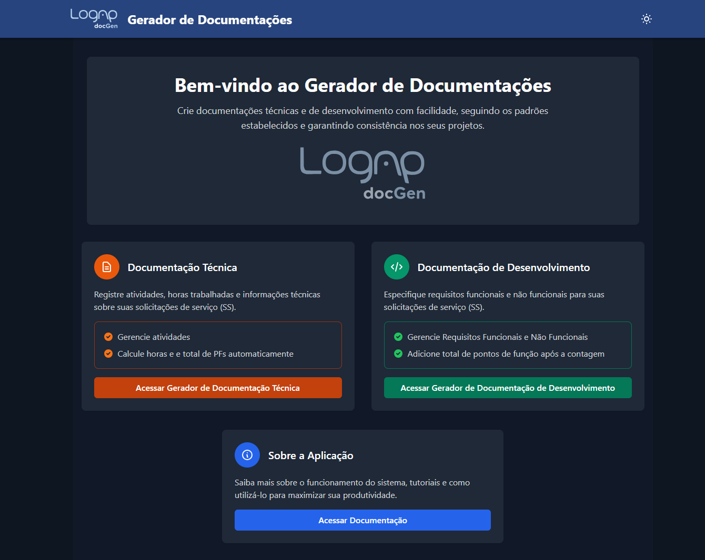
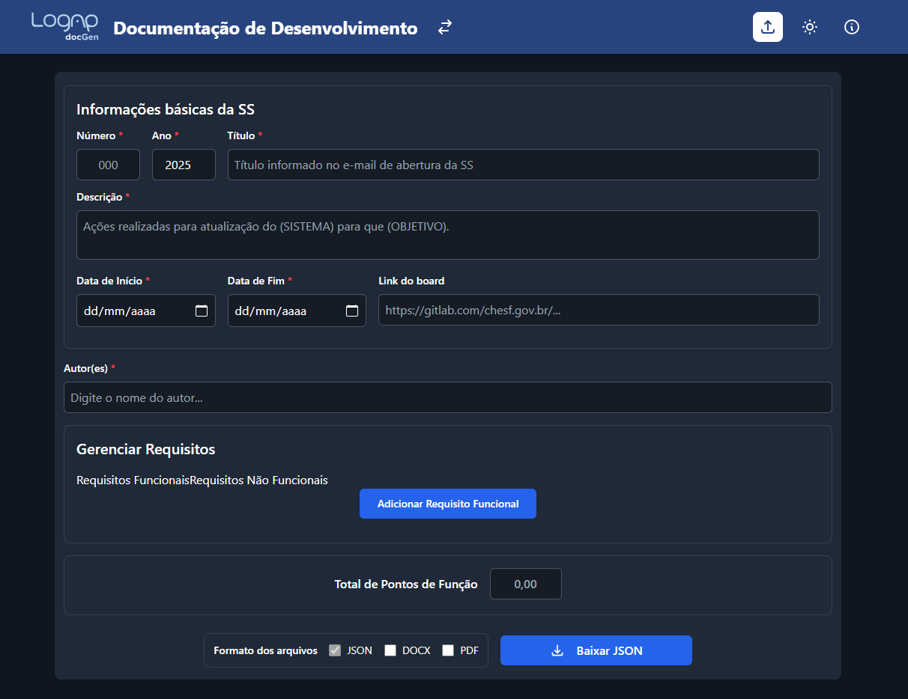

# 📝 Gerador de Documentações

[](https://www.python.org/downloads/)
[](https://flask.palletsprojects.com/)
[](https://vuejs.org/)
[](https://tailwindcss.com/)
[](https://www.docker.com/)

Uma aplicação web para geração automática de documentos técnicos e de desenvolvimento a partir de modelos padronizados, otimizando o fluxo de trabalho para relatórios e especificações de projetos.

Tela Inicial:

Tela de Documentações de Desenvolvimento

Tela de Documentações Técnicas


## 📋 Sumário

- [Visão Geral](#-visão-geral)
- [Tecnologias](#-tecnologias)
- [Requisitos](#-requisitos)
- [Instalação e Execução](#-instalação-e-execução)
- [Estrutura Principal](#-estrutura-principal)
- [Principais Funcionalidades](#-principais-funcionalidades)
- [Como Usar](#-como-usar)
- [Modelos e Marcadores](#-modelos-e-marcadores)
- [Desenvolvedores](#-desenvolvedores)

## 🔍 Visão Geral

O Gerador de Documentações automatiza a criação de documentos padronizados para Solicitações de Serviço (SS), oferecendo dois tipos principais de documentação:

- **Documentação Técnica**: Registro de atividades, horas trabalhadas e cálculos de pontos de função
- **Documentação de Desenvolvimento**: Especificação de requisitos funcionais e não funcionais

A aplicação substitui marcadores nos modelos com dados fornecidos pelo usuário, preservando a formatação original e gerando documentos em formatos DOCX e PDF.

## 🛠 Tecnologias

### Backend

- **Python 3.11+**
- **Flask**: Framework web
- **python-docx**: Manipulação de documentos Word
- **LibreOffice**: Conversão para PDF (Docker)

### Frontend

- **Vue.js 3**: Framework JavaScript progressivo
- **Tailwind CSS**: Framework CSS utilitário
- **Quill**: Editor rich text

### Infraestrutura

- **Docker** e **Docker Compose**: Containerização

## 📋 Requisitos

- **Docker Desktop** instalado e em execução
- **Git** para clonagem do repositório

## 🚀 Instalação e Execução

### 1. Clone o repositório

```bash
git clone <url-do-repositorio>
cd gerador-de-documentacoes
```

### 2. Execute com Docker

**Windows:**

```bash
.\deploy.bat
```

**Linux/Mac:**

```bash
npm run build
docker-compose up --build -d
```

### 3. Acesse a aplicação

Abra seu navegador e acesse: **http://localhost:5000**

> O script `deploy.bat` automatiza todo o processo de build do frontend e inicialização dos contêineres Docker.

## 📁 Estrutura Principal

```
gerador-de-documentacoes/
├── app.py                 # Aplicação Flask principal
├── deploy.bat             # Script de implantação automatizada
├── Dockerfile             # Configuração do contêiner
├── docker-compose.yml     # Orquestração dos serviços
├── requirements.txt       # Dependências Python
├── package.json           # Dependências JavaScript
├── src/                   # Código-fonte Vue.js
│   ├── components/        # Componentes reutilizáveis
│   ├── views/             # Páginas principais
│   └── assets/           # Recursos estáticos
├── static/               # Arquivos compilados
└── modelos/              # Modelos de documentos
    ├── tecnica/          # Modelos técnicos
    └── desenvolvimento/  # Modelos de desenvolvimento
```

## ✨ Principais Funcionalidades

### Interface e Usabilidade

- Interface responsiva com tema claro/escuro
- Navegação intuitiva entre tipos de documentação
- Exportação em JSON, DOCX e PDF
- Sistema de importação/exportação para continuidade do trabalho

### Documentação Técnica

- Gerenciamento de atividades com drag-and-drop
- Estimativa de horas por atividade
- Cálculos automáticos de pontos de função

### Documentação de Desenvolvimento

- **Requisitos Funcionais (RF)**:
  - Especificação detalhada com ID automático
  - Editor rich text para descrição, regras e validações
  - Upload de imagens para diagramas e screenshots
  - Campos para tipo, local, usuário e perfil
  - Reordenação via drag-and-drop com atualização automática de IDs
- **Requisitos Não Funcionais (RNF)**:
  - Registro com título e descrição
  - ID sequencial automático
  - Reordenação via drag-and-drop
- **Pontos de Função**: Campo para total após análise

## 🔄 Como Usar

1. **Selecione o tipo** de documentação (Técnica ou Desenvolvimento)
2. **Preencha informações básicas**: SS, autor(es), datas, descrição
3. **Configure dados específicos**: atividades/horas ou requisitos
4. **Escolha formatos** de saída (DOCX, PDF, JSON)
5. **Gere a documentação** e faça o download do arquivo ZIP

> [!TIP]
> Use a exportação JSON para salvar progresso e continuar posteriormente via importação.

## 📝 Modelos e Marcadores

A aplicação suporta três tipos de documentos para cada categoria:

- Relatório de Acompanhamento de Projeto
- Estratégia de Solução
- Estimativa de Esforço e Cronograma

### Marcadores Básicos

| Marcador        | Descrição                |
| --------------- | ------------------------ |
| `[NNN]`         | Número da SS formatado   |
| `[AAAA]`        | Ano da SS                |
| `[TITULO]`      | Título da SS             |
| `[DESCRICAO]`   | Descrição da atividade   |
| `[TOTAL_HORAS]` | Total de horas calculado |
| `[N_PF]`        | Pontos de função         |
| `[LINK_BOARD]`  | Link do board do projeto |
| `[DATA_INICIO]` | Data de início formatada |
| `[DATA_FIM]`    | Data de fim formatada    |
| `[DIAS_UTEIS]`  | Dias úteis calculados    |

### Marcadores Específicos

#### Documentação Técnica

| Marcador       | Descrição          |
| -------------- | ------------------ |
| `[ITEM]`       | Nome da atividade  |
| `[HORAS_ITEM]` | Horas da atividade |

#### Documentação de Desenvolvimento

| Marcador                       | Descrição                        |
| ------------------------------ | -------------------------------- |
| `[INICIAIS_AUTOR_CRIACAO]`     | Iniciais do autor original       |
| `[DATA_CRIACAO]`               | Data de criação inicial          |
| `[INICIAIS_AUTOR_MODIFICACAO]` | Iniciais do autor da modificação |
| `[DATA_MODIFICACAO]`           | Data da última atualização       |

---

Desenvolvido com ❤️ para automatizar e padronizar a criação de documentações técnicas.

## 🧑‍💻 Desenvolvedores:

[Deyvyd Moura](https://github.com/deyvyd) - Desenvolvedor principal
[Thiago Nascimento](https://github.com/Txiag) - Responsável pela geração do sumário
[Carlos Henrique](https://github.com/carlosbda99) - Responsável pelo ajuste na limitação do tamanho dos arquivos aceitos pelo servidor
